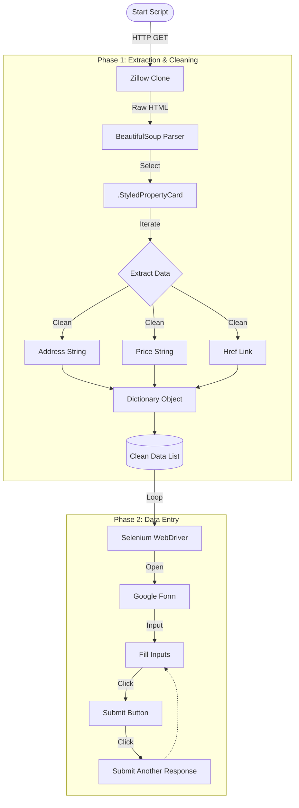

# SF Renting Research Practice


This tool scrapes real estate listings from a Zillow-clone portal and automatically puts them into a Google Form.

## Key Features
* **Data Cleaning** Automatically parses raw HTML strings, stripping newlines, pipe symbols (`|`), and messy suffixes (`+ 1bd`, `/mo`) before storage.

## Tech Stack
* **Extraction:** Python `requests` & `BeautifulSoup4`
* **Automation:** Selenium WebDriver (Chrome)
* **Target:** Google Forms

## Process Architecture


## How to Run Locally


### 1. Clone the repository
```bash
git clone [https://github.com/truedaniyyel/sf-renting-research-practice.git](https://github.com/truedaniyyel/sf-renting-research-practice.git)
cd sf-renting-research-practice
```

### 2. Install Dependencies
This project uses uv for modern package management.
```bash
uv sync
```

### 3. Configuration
1. Create a Google Form with 3 Short Answer questions:
   * Address
   * Price
   * Link
2. Create a `.env` file in the root directory and add your Google Form URL:
```env
GOOGLE_FORM_URL=YOUR_GOOGLE_FORM_LINK_HERE
```

### 4. Run the Bot
The script will open a Chrome window, scrape the data in the background, and begin filling the form automatically.
```bash
python main.py
```